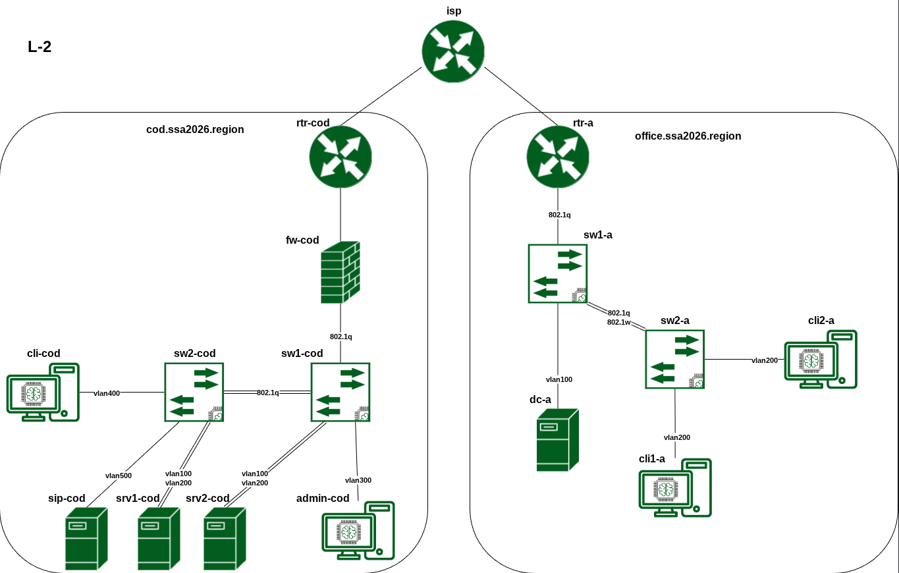

# Модуль Б. Настройка технических и программных средств информационно-коммуникационных систем

Всё ниже приведённое:

    1. не является официальной рекомендацией или призывом к действию
    2. является частным мнением и не претендует на универсальность
    3. отражает личный опыт и мнение одного человека
    4. основано на субъективном взгляде и не является истиной в последней инстанции для всех
    5. является частным случаем и не может рассматриваться как обязательная к применению инструкция

Время на выполнение модуля: 7 часов
Схема Подкоючения:

На виртуальных машинах и оборудовании используются следующие версии ОС и технологические решения:
| Название устройства 	| ОС 	                            | vCPU 		| RAM 		| 	SSD  |
| ---------        		| ---------                			| --------- | --------- | -----  |
| rtr-cod 	            | EcoRouterOS (7-jasmine)           | 2 	    | 4 		|	6    |
| fw-cod 	            | Ideco NGFW NOVUM 21 (21.5.99)     | 4 	    | 16 		|	150  |
| sw1-cod 	            | Альт Сервер 11 	                | 1 	    | 1 	    |	10   |
| sw2-cod 	            | Альт Сервер 11 	                | 1 	    | 1 	    |	10   |
| cli-cod 	            | Альт Рабочая станция 11 	        | 2 	    | 2 	    |	20   |
| srv1-cod 	            | Альт Сервер 11 	                | 2 	    | 2 	    |	20   |
| srv2-cod 	            | Альт Сервер 11 	                | 2 	    | 2   	    |	20   |
| sip-cod 	            | SNG7-PBX16 	                	| 2 	    | 2 	    |	20   |
| admin-cod 	        | Альт Рабочая станция 11 	    	| 2 	    | 2 	    |	20   |
| rtr-a 	            | EcoRouterOS (7-jasmine) 	    	| 2 	    | 4 	    |	6    |
| sw1-a 	            | Альт Сервер 11 	            	| 1 	    | 1 	    |	10   |
| sw2-a 	            | Альт Сервер 11 	            	| 1 	    | 1 	    |	10   |
| dc-a 	                | Альт Сервер 11 	            	| 2 	    | 2 	    |	20   |
| cli1-a 	            | Альт Рабочая станция 11 	    	| 2  	    | 2 	    |	20   |
| cli2-a 	            | Альт Рабочая станция 11 	    	| 2 	    | 2 	    |	20   |
| Итого: 	            |                                  	| 28 		|44 		|	362  |

Параметры интернет-провайдеров, предоставляющих услуги организации или клиентам:

| Провайдер 	| Адрес IPv4/Маска 		| Шлюз IPv4 		| AS    |
| -				| -						| -					| -		|
| GIGAFON COD 	| 178.207.179.4/29 		| 178.207.179.1 	| 31133 |
| GIGAFON A 	| 178.207.179.28/29 	| 178.207.179.25 	| 31133 |

В сети GIGAFON COD сделаны настройки BGP:

    1. Соседство устанавливается по IPv4 с адреса шлюза на выделяемый провайдером адрес через физический интерфейс и указанные выше номера автономных систем.
    2. Все провайдеры анонсируют делегируемые префиксы в “интернет”.

На DNS-сервере100.100.100.100 настроена зона ssa2026.ru

VLAN - cod:
| VLAN 	| Название 	| Устройство |
|	-	|	-		|	-		 |
| 100 	| SRV-COD 	| srv1-cod, srv2-cod |
| 200 	| DATA 		| srv1-cod, srv2-cod |
| 300 	| MGMT-COD 	| fw-cod, sw1-cod, sw2-cod, admin-cod |
| 400 	| CLI 	    | cli-cod |
| 500 	| VOIP 		| sip-cod |

| VLAN 	| Название 	| Устройство |
|	-	|	-		|	-		 |
| 100 	| SRV		| dc-a	|
| 200 	| CLI		| cli1-a, cli2-a |
| 300 	| MGMT	 	| rtr-a, sw1-a, sw2-a |

  Проверка будет производиться с использованием доменных имен.

Проверка по IP-адресам выполняться не будет.
# Используемая таблица адресации
 | VM 	     | Network Device 	 | Network  	     | VLAN 	 | IP 	            | Gateway        | 
 | - 	     | 			-		 | 	-			     | -		 | -	            | - 	         |
 | rtr-cod 	 | net1 	         | 178.207.179.0/29  | - 	     | 178.207.179.4  	| 178.207.179.1  | 
 |           | net2 	         | 172.16.1.0/30 	 |           |                  | 172.16.1.1     | 
 | fw-cod 	 | net0 	         | 172.16.1.0/30 	 |           | 172.16.1.2 	    | 172.16.1.1     | 
 |           | net1 	         | 192.168.10.0/24 	 | 100 	     | 192.168.10.254   |                | 
 |           |                   | 192.168.20.0/24 	 | 200 	     | 192.168.20.254   |                | 
 |           |                   | 192.168.30.0/24 	 | 300 	     | 192.168.30.254   |                | 
 |           |                   | 192.168.40.0/24 	 | 400 	     | 192.168.40.254   |                | 
 |           |                   | 192.168.50.0/24 	 | 500 	     | 192.168.50.254   |                |     
 | sw1-cod 	 | SVI 	             | 192.168.30.0/24 	 | 300 	     | 192.168.30.1 	| 192.168.30.254 | 
 | sw2-cod 	 | SVI 	             | 192.168.30.0/24 	 | 300 	     | 192.168.30.2 	| 192.168.30.254 | 
 | cli-cod 	 | net0 	         | 192.168.40.0/24 	 | 400 	     | 192.168.40.40 	| 192.168.40.254 | 
 | srv1-cod  | net0 	         | 192.168.10.0/24 	 | 100 	     | 192.168.10.1 	| 192.168.10.254 | 
 |           | net1 	         | 192.168.20.0/24 	 | 200 	     | 192.168.20.1     |                | 
 | srv2-cod  | net0 	         | 192.168.10.0/24 	 | 100 	     | 192.168.10.2 	| 192.168.10.254 | 
 |           | net1 	         | 192.168.20.0/24 	 | 200 	     | 192.168.20.2     |                | 
 | sip-cod 	 | net0 	         | 192.168.50.0/24 	 | 500 	     | 192.168.50.50 	| 192.168.50.254 | 
 | admin-cod | net0 	         | 192.168.30.0/24 	 | 300 	     | 192.168.30.30 	| 192.168.30.254 | 
 | rtr-a 	 | net1 	         | 178.207.179.24/29 | - 	     | 178.207.179.28 	| 178.207.179.25 | 
 |           | net2 	         | 172.20.10.0/24 	 | 100 	     | 172.20.10.254    |                | 
 |           |                   | 172.20.20.0/24 	 | 200 	     | 172.20.20.254    |                | 
 |           |                   | 172.20.30.0/24 	 | 300 	     | 172.20.30.254    |                | 
 | sw1-a 	 | SVI 	             | 172.20.30.0/24 	 | 300 	     | 172.20.30.1 	    | 172.20.30.254  | 
 | sw2-a 	 | SVI 	             | 172.20.30.0/24 	 | 300 	     | 172.20.30.2 	    | 172.20.30.254  | 
 | dc-a 	 | net0 	         | 172.20.10.0/24 	 | 100 	     | 172.20.10.10 	| 172.20.10.254  | 
 | cli1-a 	 | net0 	         | 172.20.20.0/24 	 | 200 	     | 172.20.20.1 	    | 172.20.20.254  | 
 | cli2-a 	 | net0 	         | 172.20.20.0/24 	 | 200 	     | 172.20.20.2 	    | 172.20.20.254  | 

# Настройка виртуальной машины ISP
### Задача настроить:

    Имя
    IP-адреса
    Перессылка пакетов
    NAT
    DNS
    NTP
    BGP

