# Модуль Б. Настройка технических и программных средств информационно-коммуникационных систем

Всё ниже приведённое:

    1. не является официальной рекомендацией или призывом к действию
    2. является частным мнением и не претендует на универсальность
    3. отражает личный опыт и мнение одного человека
    4. основано на субъективном взгляде и не является истиной в последней инстанции для всех
    5. является частным случаем и не может рассматриваться как обязательная к применению инструкция

Время на выполнение модуля: 7 часов
Схема Подкоючения:


На виртуальных машинах и оборудовании используются следующие версии ОС и технологические решения:
| Название устройства 	| ОС 	                            | vCPU 		| RAM 		| 	SSD  |
| ---------        		| ---------                			| --------- | --------- | -----  |
| rtr-cod 	            | EcoRouterOS (7-jasmine)           | 2 	    | 4 		|	6    |
| fw-cod 	            | Ideco NGFW NOVUM 21 (21.5.99)     | 4 	    | 16 		|	150  |
| sw1-cod 	            | Альт Сервер 11 	                | 1 	    | 1 	    |	10   |
| sw2-cod 	            | Альт Сервер 11 	                | 1 	    | 1 	    |	10   |
| cli-cod 	            | Альт Рабочая станция 11 	        | 2 	    | 2 	    |	20   |
| srv1-cod 	            | Альт Сервер 11 	                | 2 	    | 2 	    |	20   |
| srv2-cod 	            | Альт Сервер 11 	                | 2 	    | 2   	    |	20   |
| sip-cod 	            | SNG7-PBX16 	                	| 2 	    | 2 	    |	20   |
| admin-cod 	        | Альт Рабочая станция 11 	    	| 2 	    | 2 	    |	20   |
| rtr-a 	            | EcoRouterOS (7-jasmine) 	    	| 2 	    | 4 	    |	6    |
| sw1-a 	            | Альт Сервер 11 	            	| 1 	    | 1 	    |	10   |
| sw2-a 	            | Альт Сервер 11 	            	| 1 	    | 1 	    |	10   |
| dc-a 	                | Альт Сервер 11 	            	| 2 	    | 2 	    |	20   |
| cli1-a 	            | Альт Рабочая станция 11 	    	| 2  	    | 2 	    |	20   |
| cli2-a 	            | Альт Рабочая станция 11 	    	| 2 	    | 2 	    |	20   |
| Итого: 	            |                                  	| 28 		|44 		|	362  |

Параметры интернет-провайдеров, предоставляющих услуги организации или клиентам:

| Провайдер 	| Адрес IPv4/Маска 		| Шлюз IPv4 		| AS    |
| -				| -						| -					| -		|
| GIGAFON COD 	| 178.207.179.4/29 		| 178.207.179.1 	| 31133 |
| GIGAFON A 	| 178.207.179.28/29 	| 178.207.179.25 	| 31133 |

В сети GIGAFON COD сделаны настройки BGP:

    1. Соседство устанавливается по IPv4 с адреса шлюза на выделяемый провайдером адрес через физический интерфейс и указанные выше номера автономных систем.
    2. Все провайдеры анонсируют делегируемые префиксы в “интернет”.

На DNS-сервере100.100.100.100 настроена зона ssa2026.ru

VLAN - cod:
| VLAN 	| Название 	| Устройство |
|	-	|	-		|	-		 |
| 100 	| SRV-COD 	| srv1-cod, srv2-cod |
| 200 	| DATA 		| srv1-cod, srv2-cod |
| 300 	| MGMT-COD 	| fw-cod, sw1-cod, sw2-cod, admin-cod |
| 400 	| CLI 	    | cli-cod |
| 500 	| VOIP 		| sip-cod |

| VLAN 	| Название 	| Устройство |
|	-	|	-		|	-		 |
| 100 	| SRV		| dc-a	|
| 200 	| CLI		| cli1-a, cli2-a |
| 300 	| MGMT	 	| rtr-a, sw1-a, sw2-a |

 Проверка будет производиться с использованием доменных имен.
 Проверка по IP-адресам выполняться не будет.

---

# Используемая таблица адресации
 | VM 	     | Network Device 	 | Network  	     | VLAN 	 | IP 	            | Gateway        | 
 | - 	     | 			-		 | 	-			     | -		 | -	            | - 	         |
 | rtr-cod 	 | net1 	         | 178.207.179.0/29  | - 	     | 178.207.179.4  	| 178.207.179.1  | 
 |           | net2 	         | 172.16.1.0/30 	 |           |                  | 172.16.1.1     | 
 | fw-cod 	 | net0 	         | 172.16.1.0/30 	 |           | 172.16.1.2 	    | 172.16.1.1     | 
 |           | net1 	         | 192.168.10.0/24 	 | 100 	     | 192.168.10.254   |                | 
 |           |                   | 192.168.20.0/24 	 | 200 	     | 192.168.20.254   |                | 
 |           |                   | 192.168.30.0/24 	 | 300 	     | 192.168.30.254   |                | 
 |           |                   | 192.168.40.0/24 	 | 400 	     | 192.168.40.254   |                | 
 |           |                   | 192.168.50.0/24 	 | 500 	     | 192.168.50.254   |                |     
 | sw1-cod 	 | SVI 	             | 192.168.30.0/24 	 | 300 	     | 192.168.30.1 	| 192.168.30.254 | 
 | sw2-cod 	 | SVI 	             | 192.168.30.0/24 	 | 300 	     | 192.168.30.2 	| 192.168.30.254 | 
 | cli-cod 	 | net0 	         | 192.168.40.0/24 	 | 400 	     | 192.168.40.40 	| 192.168.40.254 | 
 | srv1-cod  | net0 	         | 192.168.10.0/24 	 | 100 	     | 192.168.10.1 	| 192.168.10.254 | 
 |           | net1 	         | 192.168.20.0/24 	 | 200 	     | 192.168.20.1     |                | 
 | srv2-cod  | net0 	         | 192.168.10.0/24 	 | 100 	     | 192.168.10.2 	| 192.168.10.254 | 
 |           | net1 	         | 192.168.20.0/24 	 | 200 	     | 192.168.20.2     |                | 
 | sip-cod 	 | net0 	         | 192.168.50.0/24 	 | 500 	     | 192.168.50.50 	| 192.168.50.254 | 
 | admin-cod | net0 	         | 192.168.30.0/24 	 | 300 	     | 192.168.30.30 	| 192.168.30.254 | 
 | rtr-a 	 | net1 	         | 178.207.179.24/29 | - 	     | 178.207.179.28 	| 178.207.179.25 | 
 |           | net2 	         | 172.20.10.0/24 	 | 100 	     | 172.20.10.254    |                | 
 |           |                   | 172.20.20.0/24 	 | 200 	     | 172.20.20.254    |                | 
 |           |                   | 172.20.30.0/24 	 | 300 	     | 172.20.30.254    |                | 
 | sw1-a 	 | SVI 	             | 172.20.30.0/24 	 | 300 	     | 172.20.30.1 	    | 172.20.30.254  | 
 | sw2-a 	 | SVI 	             | 172.20.30.0/24 	 | 300 	     | 172.20.30.2 	    | 172.20.30.254  | 
 | dc-a 	 | net0 	         | 172.20.10.0/24 	 | 100 	     | 172.20.10.10 	| 172.20.10.254  | 
 | cli1-a 	 | net0 	         | 172.20.20.0/24 	 | 200 	     | 172.20.20.1 	    | 172.20.20.254  | 
 | cli2-a 	 | net0 	         | 172.20.20.0/24 	 | 200 	     | 172.20.20.2 	    | 172.20.20.254  | 

---

# Настройка виртуальной машины ISP
### Задача настроить:

* Имя
* IP-адреса
* Перессылка пакетов
* NAT
* DNS
* NTP
* BGP
### Вариант реализации:

* Настройка имени на устройстве:
  
  ``` hostnamectl set-hostname isp; exec bash ```

* так же рекомендуется указать имя в файле /etc/sysconfig/network:

    ```vim /etc/sysconfig/network```

    * указать имя в параметре HOSTNAME:

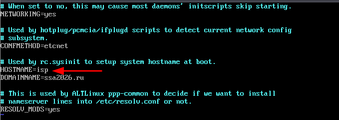

* Настройка IP-адресов:

    * ens19 - доступ в сеть Интернет (SDN Simple Zone)
    * ens20 - сеть в сторону rtr-cod
    * ens21 - сеть в сторону rtr-a

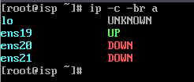

* В данном случае для доступа в сеть Интернет на ISP будет задаваться статическая конфигурация, поэтому файл options для интерфейса ens19 выглядит следующим образом:

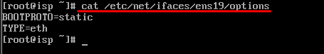

* Копируем рекурсивно директорию ens19 для интерфейсов ens20 и ens21, т.к. файл options будет выглядеть аналогичным обра
```
cp -r /etc/net/ifaces/ens19 /etc/net/ifaces/ens20
```
```
cp -r /etc/net/ifaces/ens19 /etc/net/ifaces/ens21
```
* Задаём соответствующие IP-адреса на интерфейсы:
```
echo "100.100.100.100/24" > /etc/net/ifaces/ens19/ipv4address
```
```
echo "178.207.179.1/29" > /etc/net/ifaces/ens20/ipv4address
```
```
echo "178.207.179.25/29" > /etc/net/ifaces/ens21/ipv4address
```
* Задаём IP-адрес шлюза по умолчанию и DNS-сервера (временно, для установки необходимых пакетов):
```
echo "default via 100.100.100.1" > /etc/net/ifaces/ens19/ipv4route
```
```
echo "nameserver 77.88.8.8" > /etc/net/ifaces/ens19/resolv.conf
```
* Включаем возможность перессылки пакетов:
* Для того чтобы устройство ISP могло пересылать пакеты с интерфейса на интерфейс, необходимо включить пересылку пакетов (forwarding)
    * Для этого следует в конфигурационном файле /etc/net/sysctl.conf в параметре net.ipv4.ip_forward = 0 заменить значение с 0 на 1
```
sed -i "s/net.ipv4.ip_forward = 0/net.ipv4.ip_forward = 1/g" /etc/net/sysctl.conf
```

* Для применения настроек, необходимо перезагрузить службу network
```
    systemctl restart network
```
* Проверить:
    * IP-адреса на интерфейсах:

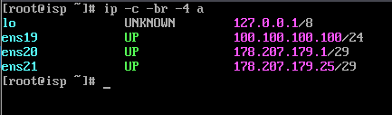
* Наличие шлюза по умолчанию и DNS:

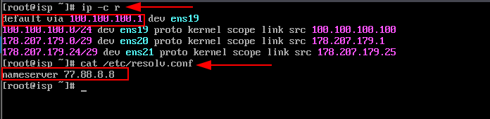

* Перессылку пакетов и доступ в сеть Интернет:

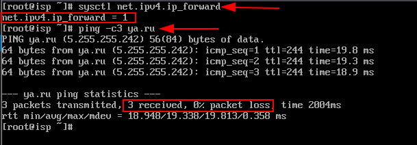

* Установим iptables для настройки NAT:
```
apt-get update && apt-get install -y iptables
```

* Реализацию сетевой трансляции адресов с помощью iptables можно выполнить одной командой:
    * где, ens19 внешний интерфейс, подключённый к магистральному провайдеру
    * также реалиуем трансляцию адресов только из конкретных сетей rtr-cod и rtr-a
```
iptables –t nat –A POSTROUTING -s 178.207.179.0/29 –o ens19 –j MASQUERADE
iptables –t nat –A POSTROUTING -s 178.207.179.24/29 –o ens19 –j MASQUERADE
```
* Сохраняем правила iptables на постоянной основе (после перезагрузки):
```    
iptables-save >> /etc/sysconfig/iptables
```
* Включаем и добавляем в автозагрузку службу iptables:
```
systemctl enable --now iptables
```

* Проверить, наличие правила в iptables, а именно в таблице nat, в цепочек POSTROUTING:


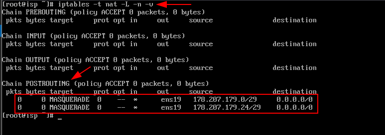

* Для установки и дальнейшей настройки DNS-сервера, необходимо выполнить установку пакета BIND:
```
apt-get install bind bind-utils -y
```

* После установки пакета bind приведём конфигурационный файл /etc/net/ifaces/ens19/resolv.conf к следующему виду:


* Для применения настроек, необходимо перезагрузить службу network
```
systemctl restart network
```

* Далее выполняется редактирование конфигурационного файла /var/lib/bind/etc/options.conf согласно скриншоту
```
vim /var/lib/bind/etc/options.conf
```

 * где:
    * listen-on параметр определяет адреса и порты, на которых DNS-сервер будет слушать запросы; 
    * В параметре forwarders указываются сервера, куда будут перенаправляться запросы, на которые нет информации в локальной зоне;
    * allow-query – IP-адреса и подсети от которых будут обрабатываться запросы;

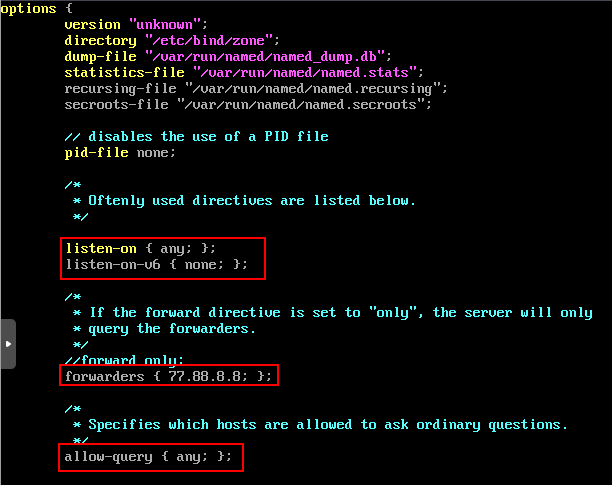

* Далее необходимо добавить зоны прямого и обратного просмотра в файл /var/lib/bind/etc/rfc1912.conf:
```
vim /var/lib/bind/etc/rfc1912.conf
```
* Добавляем следующее содержимое (в конец файла):

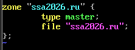

* Создаём файл зоны прямого просмотра из шаблона:
```
cp /var/lib/bind/etc/zone/empty /var/lib/bind/etc/zone/ssa2026.ru
``` 
* Необходимо сконфигурировать файл ssa2026.ru:
```
vim /var/lib/bind/etc/zone/ssa2026.ru
```
* который является прямой зоной следующим образом:

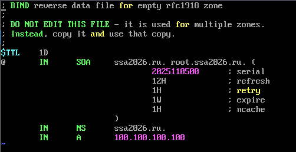

* Задать соответствующие права на файл:
```
chown root:named /var/lib/bind/etc/zone/ssa2026.ru
```
* После того, как конфигурация зон была завершена, для корректной работы службы bind необходимо выполнить команду:
```
rndc-confgen > /var/lib/bind/etc/rndc.key 
```
* Затем выполнить команду:
```
sed -i ‘6,$d’ /var/lib/bind/etc/rndc.key
```
* Результат:

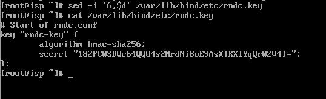

* Проверить конфигурационные файлы и файлы зон:

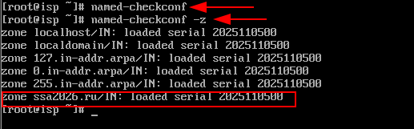

* После этого можно запустить службу bind:
```
systemctl enable --now bind.service
```
* Проверить работоспособность DNS:

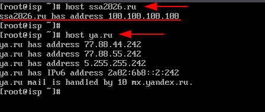

* Настроить часовой пояс:
```
timedatectl set-timezone Europe/Moscow
```
* На JeOS возможно потребуется установка пакета tzdata: 
```
apt-get install -y tzdata
```
* Проверить:
```
timedatectl
```
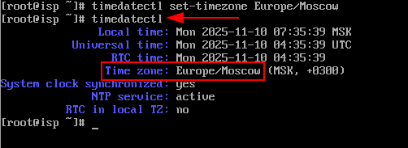

* Редактируем конфигурационный файл /etc/chrony.conf:
```
vim /etc/chrony.conf
```
* Добавляем следующую информацию:

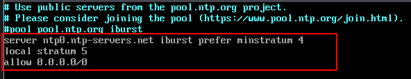

* Перезагружаем службу chronyd для применения изменений:
```
systemctl restart chronyd
```
* Проверяем:

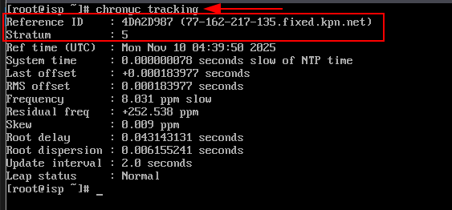

* Устанавливаем пакет frr для настройки маршрутизации:
```
apt-get install -y frr
```
* В конфигурационном файле "/etc/frr/daemons" необходимо активировать выбранный протокол для дальнейшей реализации его настройки:
```
vim /etc/frr/daemons
```
* переводим bgpd=no в bgpd=yes - для BGP:

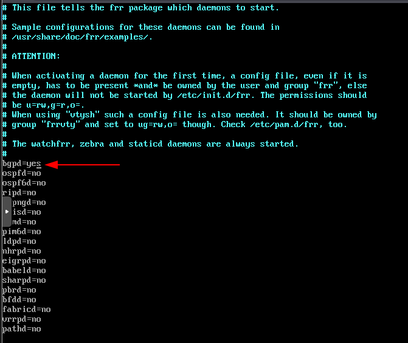

* Включаем и добавляем в автозагрузку службу frr:
```
systemctl enable --now frr
```
* Проверить:

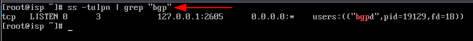

* Настраиваем BGP - переходим в интерфейс frr при помощи "vtysh":


* Реализуем настройку BGP:
    * перейдите в режим конфигурирования работы протокола BGP указав № AS;
    * задайте  router-id;
    * добавьте адрес и номер AS соседа;
    * перейдите в режим настройки address family;
    * укажите что маршрутизатор ЦОД должен получать маршрут по умолчанию по BGP;
    * сохраните конфигурацию

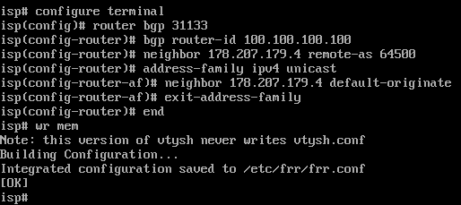

* Проверить


* Проверка подключения маршрутизатора rtr-cod по bgp:
  * без сохранения настроек, чтобы при перезугрузки конфигураци не сохранилась
```
    ecorouter>en
    ecorouter#conf t
    ecorouter(config)#interface isp
    ecorouter(config-if)#ip address 178.207.179.4/29
    ecorouter(config-if)#exit
    ecorouter(config)#  
    ecorouter(config)#port te0
    ecorouter(config-port)#service-instance te0/isp
    ecorouter(config-service-instance)#encapsulation untagged 
    ecorouter(config-service-instance)#connect ip interface isp 
    ecorouter(config-service-instance)#exit
    ecorouter(config-port)#exit
    ecorouter(config)#
    ecorouter(config)#router  bgp 64500
    ecorouter(config-router)#bgp router-id 178.207.179.4
    ecorouter(config-router)#neighbor 178.207.179.1 remote-as 31133
    ecorouter(config-router)#exit
    ecorouter(config)#exit
    ecorouter#
```
* Результат:


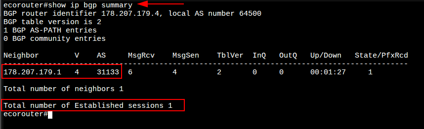

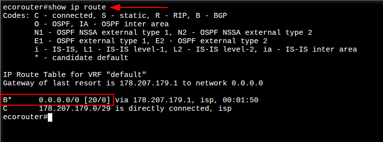

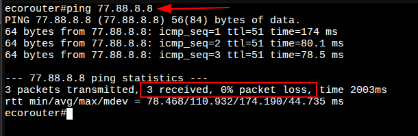

---

# 1. Настройка имён и IP-адресации на устройствах rtr-cod и rtr-a
## Вариант реализации:
### Назначение имени на устройство:

* Для назначения имени устройства согласно требованиям задания используем следующие команды:
    1. переходим в режим администрирования (enable);
    2. переходим в режим конфигурации (configure terminal);
    3. задаём имя устройству (hostname <NAME>);
    4. задаём доменное имя (ip domain-name <DOMAIN_NAME>);
    5. сохраняем конфигурацию (write memory).
```
    ecorouter>enable
    ecorouter#configure terminal 
    Enter configuration commands, one per line.  End with CNTL/Z.
    ecorouter(config)#hostname rtr-cod
    rtr-cod(config)#ip domain-name cod.ssa2026.region
    rtr-cod(config)#write memory 
    Building configuration...
    
    rtr-cod(config)#
```
* Проверить имя устройства можно командой show hostname из режима администрирования (enable):

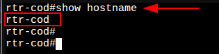

* Проверить доменное имя устройства можно командой show running-config | include domain-name из режима администрирования (enable):

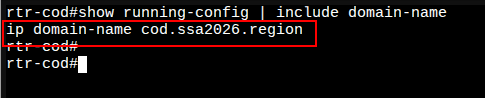

### Назначение IP-адресов на устройство:
* основные понятия касающиеся EcoRouter:
    1. Порт (port) – это устройство в составе EcoRouter, которое работает на физическом уровне (L1);
    2. Интерфейс (interface) – это логический интерфейс для адресации, работает на сетевом уровне (L3);
    3. Service instance (Сабинтерфейс, SI, Сервисный интерфейс) является логическим сабинтерфейсом, работающим на канальном уровне (L2) и связывает L1, L2 и L3 уровни:
       * Данный вид интерфейса необходим для соединения физического порта с интерфейсами L3, интерфейсами bridge, портами;
       * Используется для гибкого управления трафиком на основании наличия меток VLANов в фреймах, или их отсутствия;
       * Сквозь сервисный интерфейс проходит весь трафик, приходящий на порт.
        1. Таким образом, для того чтобы назначить IPv4-адрес на EcoRouter, необходимо придерживаться следующего алгоритма в общем виде:
        2. Создать интерфейс с произвольным именем и назначить на него IPv4-адрес;
        3. В режиме конфигурирования порта создать service-instance с произвольным именем:
           * указать (инкапсулировать) что будет обрабатываться тегированный или не тегированный трафик;
           * указать в какой интерфейс (ранее созданный) нужно отправить обработанные кадры.
    
* Посмотреть физические порты можно командой show port brief из режима администрирования (enable):
       * порт te0 направлен в сторону ВМ isp;
       * порт te1 направлен в сторону ВМ fw-cod.

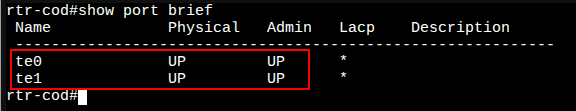

Создадим интерфейс с именем isp и назначим на него IP-адрес 178.207.179.4/29, также зададим для данного интерфейса описание (description - опциональный, необязательный параметр):

    rtr-cod(config)#interface isp
    rtr-cod(config-if)#ip address 178.207.179.4/29
    rtr-cod(config-if)#description "Connecting to an ISP provider"
    rtr-cod(config-if)#exit
    rtr-cod(config)#
Создадим интерфейс с именем fw-cod и назначим на него IP-адрес 172.16.1.1/30, также зададим для данного интерфейса описание (description - опциональный, необязательный параметр):

    rtr-cod(config)#interface fw-cod
    rtr-cod(config-if)#ip address 172.16.1.1/30
    rtr-cod(config-if)#description "Connecting to fw-cod"
    rtr-cod(config-if)#exit
    rtr-cod(config)#
Проверить назначенные IP-адреса на интерфейсы можно командой show ip interface brief из режима администрирования (enable):
    созданные интрфейсы пока не добавлены в какие-либо Service instance, а значит не привязаны и к порту, отсюда и статус down

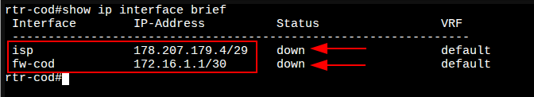

В режиме конфигурирования порта te0 необходимо создать service-instance с произвольным именем, например te0/isp:
        также необходимо указать (инкапсулировать) что будет обрабатываться не тегированный трафик (untagget);
        и указать в какой интерфейс (ранее созданный с именем isp) нужно отправлять обработанные кадры.

    rtr-cod(config)#port te0
    rtr-cod(config-port)#service-instance te0/isp
    rtr-cod(config-service-instance)#encapsulation untagged 
    rtr-cod(config-service-instance)#connect ip interface isp 
    rtr-cod(config-service-instance)#exit
    rtr-cod(config-port)#exit
    rtr-cod(config)#
В режиме конфигурирования порта te1 необходимо создать service-instance с произвольным именем, например te1/fw-cod:
        также необходимо указать (инкапсулировать) что будет обрабатываться не тегированный трафик (untagget);
        и указать в какой интерфейс (ранее созданный с именем fw-cod) нужно отправлять обработанные кадры.

    rtr-cod(config-port)#service-instance te1/fw-cod
    rtr-cod(config-service-instance)#encapsulation untagged 
    rtr-cod(config-service-instance)#connect ip interface fw-cod 
    rtr-cod(config-service-instance)#exit
    rtr-cod(config-port)#exit
    rtr-cod(config)# write memory
    
    Building configuration...

    rtr-cod(config)#

Проверить назначенные IP-адреса на интерфейсы можно командой show ip interface brief из режима администрирования (enable):

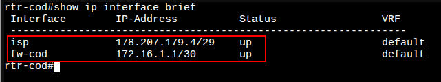

Проверить созданные Service instance можно командой show service-instance brief из режима администрирования (enable):

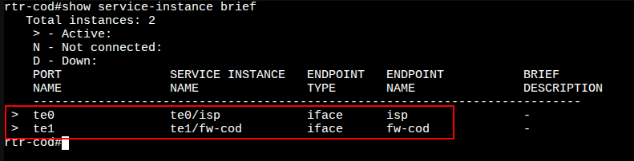

IP-адрес шлюза по умолчанию на данном устройстве на текущий момент не задаётся (будет рассмотрено далее, в соответствующем разделе), т.к. по условиям задания:
        Маршрутизатор ЦОД должен получать маршрут по умолчанию по BGP
            Ручное создание маршрута по умолчанию ЗАПРЕЩЕНО!
    Но связность с Интернет провайдером ISP проверить стоит:

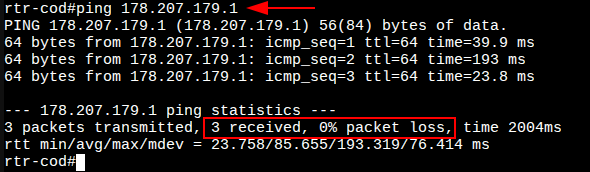

### rtr-a (ecorouter):
### Назначение имени на устройство:
Реализация аналогично rtr-cod, за исключением соответствующего доменного имени:
    имя устройства должно быть:

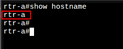

доменное имя на устройстве должно быть:

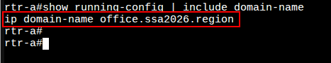

### Назначение IP-адресов на устройство:
Реализация аналогично rtr-cod, за исключением того, что на базе физического порта te1 должны быть созданы интерфейсы и Service instance с целью обработки тегированного трафика для предоставления возможности маршрутизации между VLAN (рассмотрено далее)
    должен быть создан интерфейс для подключения к Интернет провайдеру ISP:

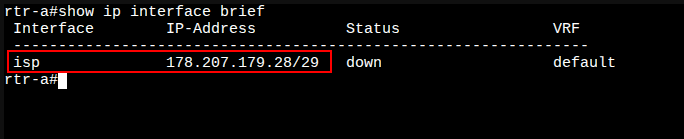

.
        должен быть создан Service instance на порту te0
        на созданный Service instance реализована обработка не тегированного трафика
        в созданный Service instance добавлен интерфейс для подключения к Интернет провайдеру

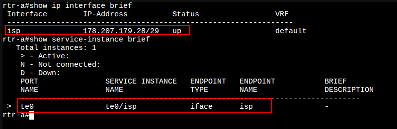

В отличае от rtr-cod, на rtr-a по заданию нет никаких требований про настройку BGP, а значит для доступа в сеть Интернет, маршрут по умолчанию можно задать вручную:
    переходим в режим конфигурации (configure terminal)
    с помощью команды ip route <IP_NETWORK/PREFIX> <NEXTHOP_IP_ADDRESS> задаём маршут по умолчанию (шлюз)
    rtr-a(config)#ip route 0.0.0.0/0 178.207.179.25
    rtr-a(config)#
Проверить назначенный маршрут по умолчанию можно командой show ip route static из режима администрирования (enable):

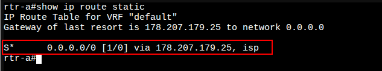

.
    Так же стоит проверить доступ в сеть Интернет:

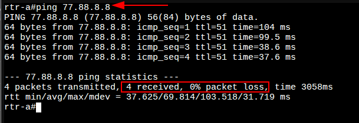

Реализуем создание под-интерфейсов для дальнейшем маршрутизации между VLAN-ами:
    Создаём интерфейсы с произвольными именами для каждого VLAN-а и назначаем на них IP-адреса:

    rtr-a(config)#interface vl100
    rtr-a(config-if)#ip address 172.20.10.254/24
    rtr-a(config-if)#description "VLAN - SRV"
    rtr-a(config-if)#exit
    rtr-a(config)#
    rtr-a(config)#interface vl200
    rtr-a(config-if)#ip address 172.20.20.254/24
    rtr-a(config-if)#description "VLAN - CLI"
    rtr-a(config-if)#exit
    rtr-a(config)#
    rtr-a(config)#interface vl300
    rtr-a(config-if)#ip address 172.20.30.254/24
    rtr-a(config-if)#description "VLAN - MGMT"
    rtr-a(config-if)#exit
    rtr-a(config)#

Проверить назначенные IP-адреса на интерфейсы можно командой show ip interface brief из режима администрирования (enable):
    созданные интрфейсы пока не добавлены в какие-либо Service instance, а значит не привязаны и к порту, отсюда и статус down

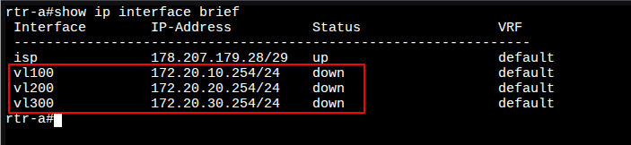

/
        на базе физического интерфейса te1 для каждого VLAN-а создаём service-instance с инкапсуляцией соответствующих тегов (VID) и подключением необходимых интерфейсов:

### Пояснение к листингу команд указанному ниже
Операции над метками в сервисных интерфейсах:
    Есть три варианта операций над метками: удаление существующей метки/меток, добавление новой метки (меток) и трансляция метки/меток из одного значения в другое.
    
Пояснение команд:
    Указание номера, обрабатываемого VLAN выполняется на service-instance с помощью команды encapsulation dot1q <VID> exact
        опция exact показывает, что под это правило попадут кадры только с меткой равной <VID>
        слово exact писать не обязательно, так как это поведение по умолчанию и в выводе show run это слово не отображается
    Указание выполняемой операции выполняется на service-instance с помощью команды rewrite pop <№>
        ключ 1 показывает, что снимаем только одну, верхнюю метку, на L3 кадр должен поступать без признаков VLAN

    rtr-a(config)#port te1
    rtr-a(config-port)#service-instance te1/vl100
    rtr-a(config-service-instance)#encapsulation dot1q 100
    rtr-a(config-service-instance)#rewrite pop 1
    rtr-a(config-service-instance)#connect in
    rtr-a(config-service-instance)#connect ip interface vl100                   
    rtr-a(config-service-instance)#exit
    rtr-a(config-port)#
    rtr-a(config-port)#service-instance te1/vl200
    rtr-a(config-service-instance)#encapsulation dot1q 200
    rtr-a(config-service-instance)#rewrite pop 1
    rtr-a(config-service-instance)#connect ip interface vl200 
    rtr-a(config-service-instance)#exit
    rtr-a(config-port)#
    rtr-a(config-port)#service-instance te1/vl300
    rtr-a(config-service-instance)#encapsulation dot1q 300
    rtr-a(config-service-instance)#rewrite pop 1
    rtr-a(config-service-instance)#connect ip interface vl300 
    rtr-a(config-service-instance)#exit
    rtr-a(config-port)#exit
    rtr-a(config)#write memory
    
    Building configuration...
    
    rtr-a(config)#

Проверить назначенные IP-адреса на интерфейсы можно командой show ip interface brief из режима администрирования (enable):

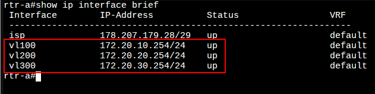

Проверить созданные Service instance можно командой show service-instance brief из режима администрирования (enable):

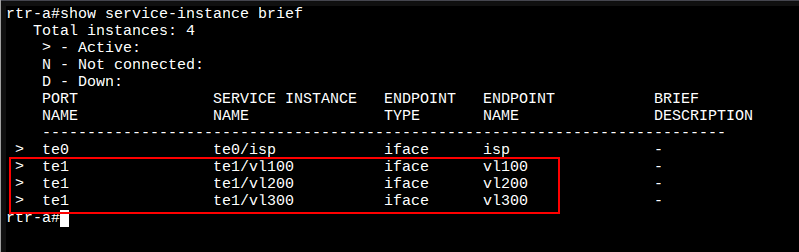
# 2. Подход к настройке fw-cod
## Вариант реализации:
### fw-cod (ideco):
### Создание учетной записи администратора
Создайте учетную запись администратора после уведомления Создание аккаунта администратора:


    Требования к логину и паролю:
        Логин:
            Не должен начинаться с цифры.
            Не должен содержать специальных и пробельных символов, кроме дефиса -.
            Длина логина - от 1 до 31 символа включительно.
        Пароль:
            Длина пароля - от 10 до 42 символов.
            Содержит строчные и заглавные латинские буквы.
            Содержит цифры.
            Содержит специальные символы (! # $ % & ' * + и другие).
    Если пароль не соответствует требованиям политики безопасности, то появится надпись с информацией, что пароль ненадежен. Потребуется ввести новый пароль с учетом требований к нему.
    Создадим пользователя admin с паролем P@ssw0rd1234:

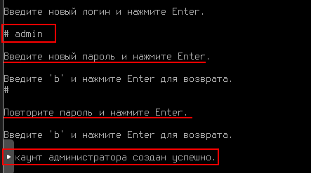

    Настройка интерфейса управления
    Для корректной идентификации сетевой карты используйте MAC-адрес сетевой карты
    Для настройки Ideco NGFW Novum через веб-интерфейс настройте Control Plane интерфейс в локальном меню
        Control Plane - интерфейс администрирования, используется для настройки NGFW Novum через браузер и должен иметь свой выход в Интернет
    Выполните вход из под созданного пользователя admin с паролем P@ssw0rd1234

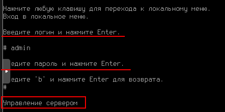

Перейдите в раздел Ethernet-интерфейсы (3) → Создать интерфейс (3):

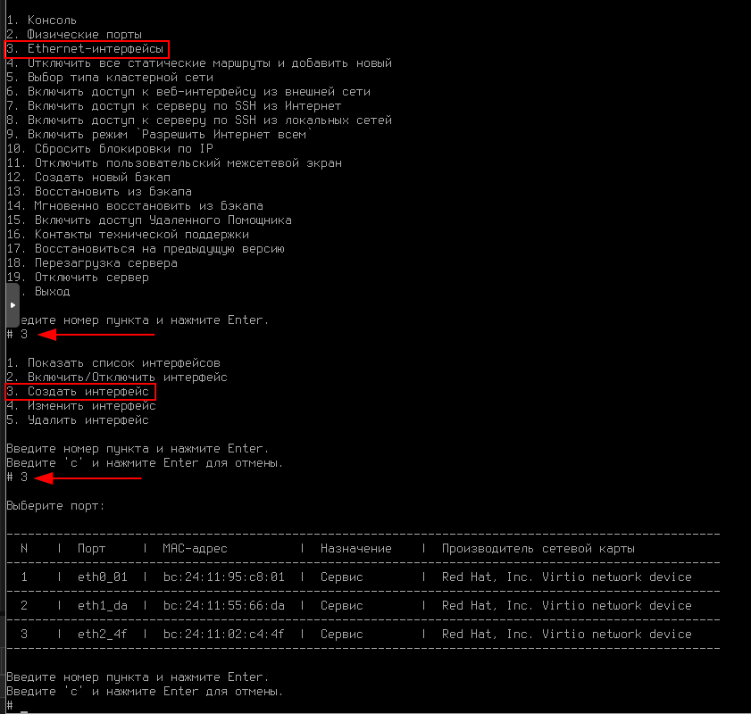

    Пояснения в контексте текущего задания:
    Поскольку Ideco рекомендуется настраивать через веб-интерфейс, надо настроить IP-адрес для этого доступа
    Поскольку в сod.ssa2026.region между fw-cod и sw1-cod необходимо организовать агрегированное соединение 802.3ad, (не актуально, от 802.3ad в задании отказались)
        а также за маршрутизацию между VLAN-ами по топологии будет отвечать fw-cod,
        то так называемые под-интерфейсы необходимо реализовывать поверх агрегированного канала 802.3ad,
        в консоле Ideco - это реализовать не получится, править конфигурационные файлы в ideco плохо, можно лишиться технической поддержки.
    Поэтому как один из способов доступа к веб-интерфейсу это:
        использование интерфейса в сторону rtr-cod,
        после реализации туннеля и маршрутизации между rtr-cod и rtr-a, 
        а также коммутации между sw1-a и sw2-a,
        у нас появится возможность конфигурировать fw-cod через веб-интерфейс, например с cli1-a или cli2-a,
        вследствии чего и полная связность между устройствами сod.ssa2026.region и office.ssa2026.region

Продолжение настройки:
    Выберите порт для доступа к веб-интерфейсу:
        сравнив МАС-адреса на уровне виртуальной машины
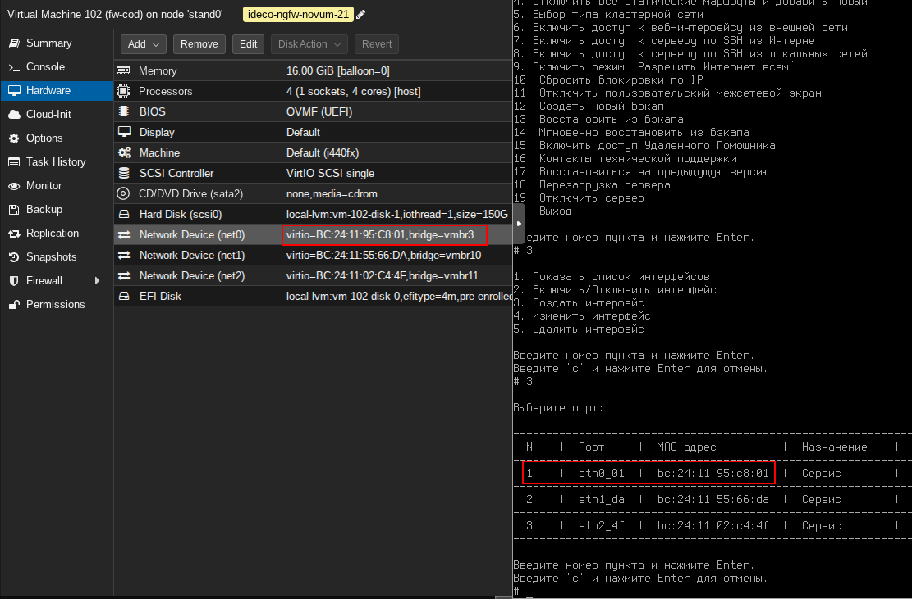


Выберите порт для доступа к веб-интерфейсу:
        в текущем случае выбирается порт в сторону виртуальной машины rtr-cod

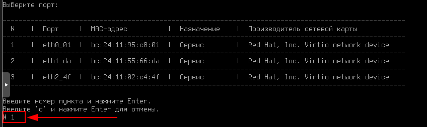

Введите имя интерфейса:

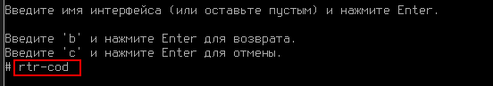

Выберите роль LAN:

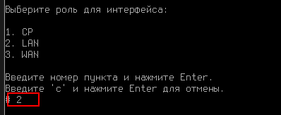

Выберите Корневой контекст:

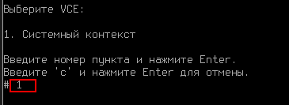

Настройте локальную сеть Вручную:

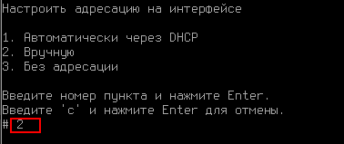

Ведите локальный IP-адрес и маску подсети в формате ip/маска и нажмите Enter:

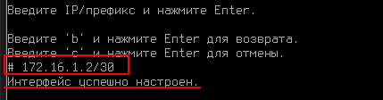

Проверить можно выбрав соответствующий пункт меню:

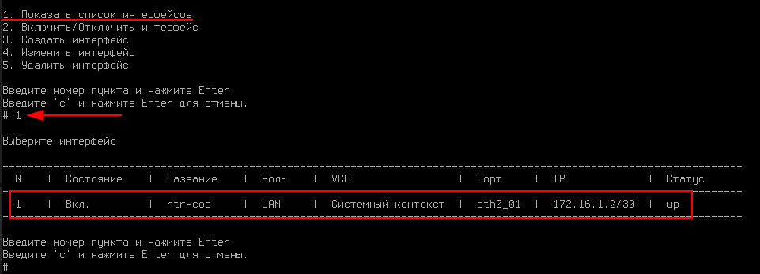


Также при вводе с клавиатуры "с" и нажатие Enter или же сочетание клавич Ctrl + D:
        можно увидеть адрес и порт для доступа к веб-интерфейсу для дальнейшей настройки

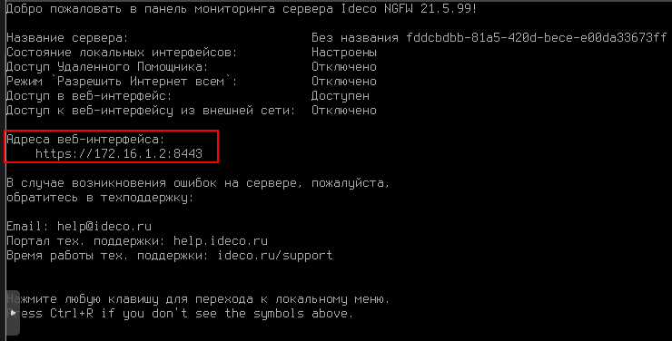

# 3. Настройка маршрутизации BGP на rtr-cod
## Вариант реализации:
### rtr-cod (ecorouter):
### Базовая настройка BGP: 
* Запустите протокол BGP, указав нужную автономную систему, командой: router bgp <№>

        rtr-cod(config)#router  bgp 64500
        rtr-cod(config-router)#
* Указать уникальный идентификатор маршрутизатора в протоколе BGP, командой: bgp router-id <IP>:

        rtr-cod(config-router)#bgp router-id 178.207.179.4
        rtr-cod(config-router)#
* Сконфигурируйте BGP соседство c Интернет провайдером ISP, указав адрес соседа и номер локальной AS, используя команду: neighbor <NEIGHBOR_IP> remote-as <$>:

        rtr-cod(config-router)#neighbor 178.207.179.1 remote-as 31133
        rtr-cod(config-router)#exit
        rtr-cod(config)#write memory
        Building configuration...

        rtr-cod(config)#

  * Проверить состояние всех соединений BGP можно командой show ip bgp summary из режима администрирования (enable):

  

  * Также по условиям задания rtr-cod должен получать маршрут по умолчанию по BGP
  * Проверить маршрут по умолчанию можно командой show ip route из режима администрирования (enable):
 
  

 * Проверить доступ в сеть Интернет:

   

# 4. Настройка туннелей между офисом «а» и «cod»
## Вариант реализации: 
### rtr-cod (ecorouter):
### Настройка туннеля GRE между устройствами:
* Создайте интерфейс туннеля c именем tunnel.0:

        rtr-cod(config)#interface tunnel.0
        rtr-cod(config-if-tunnel)#

  * Назначьте ip адрес в соответствие с требования задания:
 
        rtr-cod(config-if-tunnel)#ip address 10.10.10.1/30
        rtr-cod(config-if-tunnel)#
  * Задайте режим работы туннеля GRE и адресов начала (источника - rtr-cod) и конца туннеля (назначения - rtr-a):

        rtr-cod(config-if-tunnel)#ip tunnel 178.207.179.4 178.207.179.28 mode gre
        rtr-cod(config-if-tunnel)# exit
        rtr-cod(config)#write memory
        Building configuration...

        rtr-cod(config)#

    * Для просмотра состояния туннеля используется команда show interface tunnel.0 из режима администрирования (enable):


### rtr-a (ecorouter):
### Настройка туннеля GRE между устройствами:
* Реализация аналогично rtr-cod, за исключением соответствующего IP-адресов источника и назначения:
состояния туннеля должно быть:


* Должна быть связность по туннелю:


# 5. Настройка доступа в Интернет
## Вариант реализации
### rtr-cod (ecorouter):
### Настройка dynamic PAT:
* Определяемся с внутренними (inside) и внешними (outside) интерфейсами с точки зрения технологии NAT:
    * интерфейс isp - внешний (outside);
    * интерфейс fw-cod - внутренний (inside)


* Назначаем интерфейс isp как ip nat outside:

        rtr-cod(config)#interface isp 
        rtr-cod(config-if)#ip nat outside 
        rtr-cod(config-if)#exit
        rtr-cod(config)#
  * Назначаем интерфейс fw-cod как ip nat inside:

        rtr-cod(config)#interface fw-cod 
        rtr-cod(config-if)#ip nat inside 
        rtr-cod(config-if)#exit
        rtr-cod(config)#
* Создаём nat pool, чтобы указать диапазоны IP-адресов, который в дальнейшем будут попадать под правила трансляции: 
  * необходимо не только указать диапазон IP-адресов из сети между rtr-cod и fw-cod
  *  но и диапазоны IP-адресов из сетей:
     * 192.168.10.0/24 - vlan100
     * 192.168.30.0/24 - vlan300
     * 192.168.40.0/24 - vlan400
     * 192.168.50.0/24 - vlan500
  * т.к. в дальнейшем будет реализована маршрутизация между rtr-cod и fw-cod
  * диапазон 192.168.20.0/24 - vlan200 указывать не надо, т.к. по условиям задания
     * "Для «cod» трафик VLAN - DATA не должен маршрутизироваться"

            rtr-cod(config)#ip nat pool fw-cod 172.16.1.1-172.16.1.2
            rtr-cod(config)#ip nat pool vlan100 192.168.10.1-192.168.10.254
            rtr-cod(config)#ip nat pool vlan300 192.168.30.1-192.168.30.254
            rtr-cod(config)#ip nat pool vlan400 192.168.40.1-192.168.40.254
            rtr-cod(config)#ip nat pool vlan500 192.168.50.1-192.168.50.254
            rtr-cod(config)#
* Создать правило трансляции адресов для каждого созданного nat pool, через интерфейс, который с точки зрения NAT outside:

        rtr-cod(config)#ip nat source dynamic inside pool fw-cod overload interface isp 
        rtr-cod(config)#ip nat source dynamic inside pool vlan100 overload interface isp
        rtr-cod(config)#ip nat source dynamic inside pool vlan300 overload interface isp 
        rtr-cod(config)#ip nat source dynamic inside pool vlan400 overload interface isp 
        rtr-cod(config)#ip nat source dynamic inside pool vlan500 overload interface isp 
        rtr-cod(config)#write memory
        Building configuration...

        rtr-cod(config)#
* Проверить доступ в сеть Интернет с виртуальной машины fw-cod используя консоль:


    * временно назначаем адрес шлюза по умолчанию, используя команду ip route add:

        ip route add 0.0.0.0/0 via 172.16.1.1
* Проверяем доступ в сеть Интернет:


* На rtr-cod проверяем таблицу трансляции адресов командой show ip nat translations из режима администрирования (enable):


* Так же на данном этапе стоит добавить статические маршруты в локальные сети COD-а:
   * динамическую маршрутизацию, например OSPF между rtr-cod и fw-cod по условиям задания реализовать нельзя, т.к.
   * на rtr-cod в дальнейшем для обеспечения динамической маршрутизации между офисом «a» и «cod»
       * "Все интерфейсы, кроме туннельных, должны быть переведены в пассивный режим"
   * так же не стоит добавлять маршрут в сеть 192.168.20.0/24 (vlan200), т.к.
       * "Для «cod» трафик VLAN - DATA не должен маршрутизироваться"

             rtr-cod(config)#ip route 192.168.10.0/24 172.16.1.2
             rtr-cod(config)#ip route 192.168.30.0/24 172.16.1.2
             rtr-cod(config)#ip route 192.168.40.0/24 172.16.1.2
             rtr-cod(config)#ip route 192.168.50.0/24 172.16.1.2
             rtr-cod(config)#

* Проверить таблицу маршрутизации можно командой show ip route из режима администрирования (enable):


### rtr-a (ecorouter):
### Настройка dynamic PAT:
* Реализация аналогично rtr-cod, за исключением:
    * интерфейсы с точки зрения NAT должны быть:

    * nat pool должны быть:


* test
    * созданные правила трансляции:


* Доступ в сеть Интернет можно проверить с виртуальной машины sw1-a используя команды временного назначения IP-адресов и шлюза:
    * назначив средствами iproute2 временно на интерфейс,смотрящий в сторону rtr-a (ens19),
    * создав тегированный подинтерфейс с IP-адресом из подсети для vlan300

            ip link add link ens19 name ens19.300 type vlan id 300
            ip link set dev ens19.300 up
            ip addr add 172.20.30.1/24 dev ens19.300
            ip route add 0.0.0.0/0 via 172.20.30.254
* Доступ в сеть Интернет с sw1-a:


* На rtr-a проверяем таблицу трансляции адресовкомандой show ip nat translations из режима администрирования (enable):


# 19

    iscsiadm --mode discovery --op update --type sendtargets --portal targetIP
    
The IP address of each discovered target displays on a separate line.
 Establish iSCSI sessions by logging in to each target:

    iscsiadm --mode node -l all
You can view a list of the active iSCSI sessions:
  
    iscsiadm --mode session

    iscsiadm --mode discovery --op update --type sendtargets --portal targetIP
    iscsiadm --mode node -l all


# 22 Настройка системы мониторинга
на rtr-a прописать security none, иначе не работает smnp нормально
